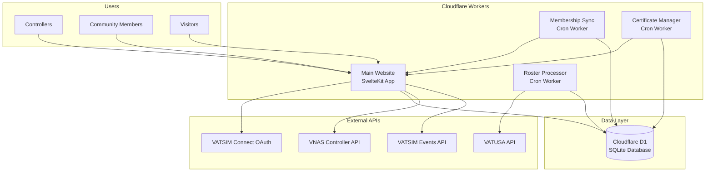

# Indianapolis Center Architecture Documentation

This documentation provides a comprehensive overview of the Indianapolis Center community website architecture, designed for developers, administrators, and community members who want to understand how the system works.

## 📚 Documentation Index

### Core Architecture
- **[System Architecture](#system-architecture)** - High-level system design and component relationships
- **[Database Schema](DATABASE.md)** - Complete database structure and relationships
- **[Authentication Flow](AUTHENTICATION.md)** - VATSIM Connect integration and session management
- **[API Documentation](API.md)** - Endpoint specifications and usage examples

### Development & Operations
- **[Development Setup](DEVELOPMENT.md)** - Local development environment setup
- **[Deployment Guide](DEPLOYMENT.md)** - Production deployment procedures
- **[Contributing Guidelines](CONTRIBUTING.md)** - Code style and contribution workflow
- **[Troubleshooting](TROUBLESHOOTING.md)** - Common issues and solutions

### Business Logic
- **[User Management](USER_MANAGEMENT.md)** - Membership levels and permissions
- **[Certificate System](CERTIFICATION.md)** - Controller certification tracking
- **[Data Synchronization](DATA_SYNC.md)** - Automated data processing workflows

---

## System Architecture

The Indianapolis Center website is built as a modern, serverless application optimized for the aviation community. The system consists of two main components working together to provide a seamless user experience.

### Component Overview



### Core Technologies

#### Frontend Stack
- **SvelteKit 5** - Full-stack web framework with server-side rendering
- **TypeScript** - Type-safe development with excellent DX
- **TailwindCSS 4** - Utility-first CSS framework for responsive design
- **Superforms** - Advanced form handling with validation
- **Unplugin Icons** - Icon system with Material Design icon set

#### Backend & Infrastructure
- **Cloudflare Workers** - Edge computing platform for low-latency responses
- **Cloudflare D1** - Serverless SQLite database with global replication
- **Drizzle ORM** - Type-safe database operations and migrations
- **Arctic OAuth** - Secure VATSIM Connect authentication
- **Node.js Compatibility** - Full Node.js API support in Workers runtime

### Data Flow Architecture

#### 1. User Authentication Flow
```
User → VATSIM Connect → OAuth Callback → Session Creation → User Dashboard
```

#### 2. Controller Registration Flow  
```
VATUSA Roster Update → Roster Processor → User Promotion → Certificate Assignment
```

#### 3. Real-Time Data Updates
```
Cron Schedule → Task Runner → External API → Database Update → Cache Invalidation
```

## Key Architectural Decisions

### 1. Serverless-First Design
**Decision:** Use Cloudflare Workers for both the main site and task runners.

**Benefits:**
- Global edge deployment for low latency
- Automatic scaling without infrastructure management
- Cost-effective for community organization workloads
- Simplified deployment and monitoring

### 2. Monorepo Structure
**Decision:** Single repository with npm workspaces for multiple related projects.

**Benefits:**
- Shared configuration and dependencies
- Unified deployment scripts
- Consistent development experience
- Easy cross-project refactoring

### 3. VATSIM-Native Authentication
**Decision:** Use VATSIM Connect exclusively for user authentication.

**Benefits:**
- Seamless integration with VATSIM ecosystem
- Automatic user verification for aviation community
- No password management or user registration complexity
- Official VATSIM endorsement and support

### 4. Real-Time Data Synchronization
**Decision:** Implement separate cron workers for different data sync operations.

**Benefits:**
- Isolated failure domains (roster sync failure doesn't affect certificates)
- Independent scaling and monitoring
- Clear separation of concerns
- Flexibility in scheduling different operations

### 5. Progressive Membership System
**Decision:** Implement tiered membership (Basic → Community → Controller) with automatic promotion.

**Benefits:**
- Encourages community engagement
- Automated onboarding for controllers
- Clear privilege escalation path
- Supports community growth and retention

## Data Architecture

### Database Design Principles

#### 1. Audit Trail Preservation
All external API data is stored in raw JSON format alongside normalized fields to maintain complete audit trails and support future data migrations.

#### 2. Eventual Consistency
The system is designed to handle temporary inconsistencies between external APIs and local data, with eventual consistency achieved through regular synchronization.

#### 3. Graceful Degradation
Core functionality remains available even when external services are unavailable, with cached data and fallback mechanisms.

### Performance Considerations

#### 1. Database Operations
- **Bulk Operations** - Use D1's batch API for roster updates (500+ records)
- **Efficient Queries** - Optimized SQL with proper indexing
- **Connection Pooling** - Automatic connection management by Cloudflare

#### 2. External API Integration
- **Rate Limiting** - Respectful API usage with appropriate delays
- **Error Handling** - Robust retry logic with exponential backoff
- **Caching Strategy** - Smart caching to reduce API calls

#### 3. Frontend Performance
- **Code Splitting** - Automatic route-based code splitting
- **Asset Optimization** - Cloudflare's global CDN for static assets
- **Progressive Enhancement** - Works without JavaScript for core functions

## Security Architecture

### Authentication Security
- **OAuth 2.0** - Industry-standard secure authentication
- **State Verification** - CSRF protection in OAuth flow
- **Session Management** - HTTP-only cookies with secure flags
- **Token Rotation** - Automatic refresh token handling

### Authorization Model
- **Role-Based Access Control** - Granular permissions by membership level
- **Admin Route Protection** - Server-side middleware for sensitive areas
- **API Key Management** - Secure handling of external API credentials

### Data Protection
- **No Credential Storage** - OAuth tokens handled securely without persistence
- **Audit Logging** - Complete audit trail for administrative actions
- **Input Validation** - Server-side validation for all user inputs

## Monitoring & Observability

### Built-in Monitoring
- **Cloudflare Analytics** - Request metrics and performance data
- **Worker Logs** - Real-time logging for debugging and monitoring
- **Error Tracking** - Automatic error capture and alerting
- **Database Metrics** - D1 query performance and usage statistics

### Health Checks
- **Cron Job Monitoring** - Automated verification of scheduled tasks
- **API Dependency Checks** - Monitor external service availability
- **Database Health** - Connection and performance monitoring

## Scalability Considerations

### Horizontal Scaling
- **Edge Computing** - Global deployment with Cloudflare's network
- **Automatic Scaling** - Workers scale to zero and handle traffic spikes
- **Database Replication** - D1's automatic global replication

### Performance Optimization
- **Caching Strategy** - Multiple layers of caching for optimal performance
- **Asset Optimization** - Optimized bundles and lazy loading
- **Database Optimization** - Efficient queries and proper indexing

## Future Architecture Evolution

### Planned Enhancements
1. **Event Management System** - Comprehensive event planning and signup
2. **Real-Time Communications** - WebSocket integration for live updates
3. **Mobile Applications** - Native mobile apps using the same API
4. **Advanced Analytics** - Community engagement and usage analytics
5. **Third-Party Integrations** - Enhanced pilot club and external service support

### Architectural Flexibility
The current architecture is designed to support these future enhancements without major refactoring:

- **API-First Design** - Clean separation enables mobile apps and integrations
- **Modular Components** - Easy to extend with new features
- **Scalable Infrastructure** - Can handle increased load and complexity
- **Type Safety** - TypeScript ensures maintainable code growth

---

## Next Steps

For detailed information about specific components, see the individual documentation files:

- Start with [DEVELOPMENT.md](DEVELOPMENT.md) for setting up your development environment
- Review [DATABASE.md](DATABASE.md) for understanding the data model
- Check [API.md](API.md) for endpoint documentation
- See [DEPLOYMENT.md](DEPLOYMENT.md) for production deployment procedures

## Questions or Issues?

- **Technical Issues** - Create an issue in the GitHub repository
- **Architecture Questions** - Contact the development team
- **Community Questions** - Join our Discord server

*This documentation is maintained by the Indianapolis Center development team and updated with each major release.*